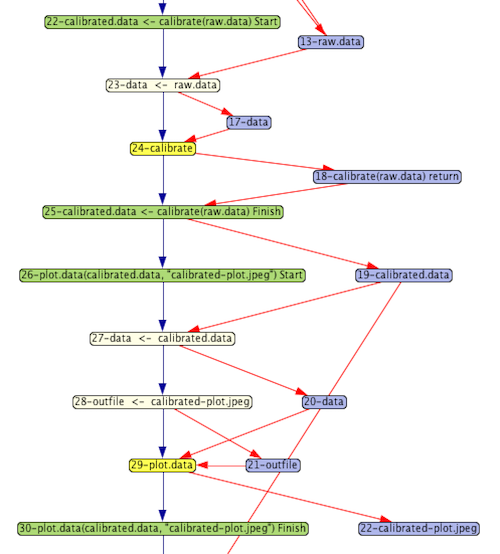
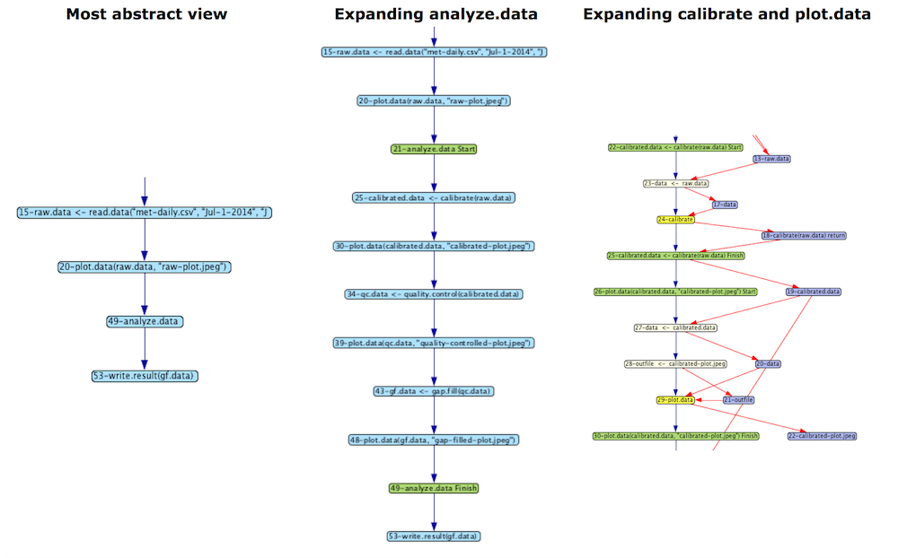
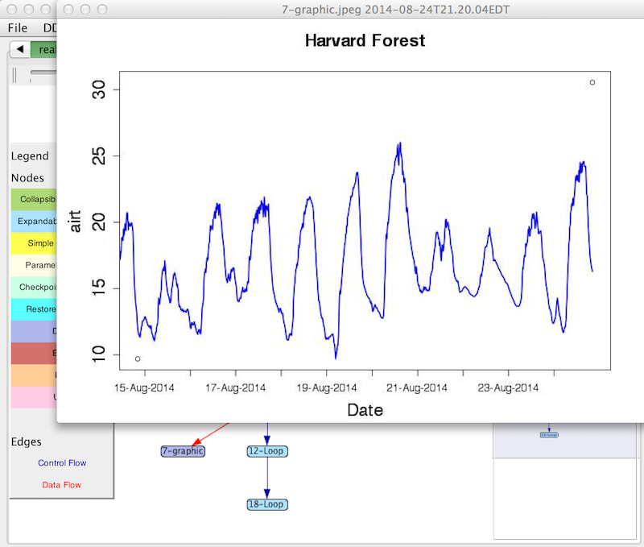
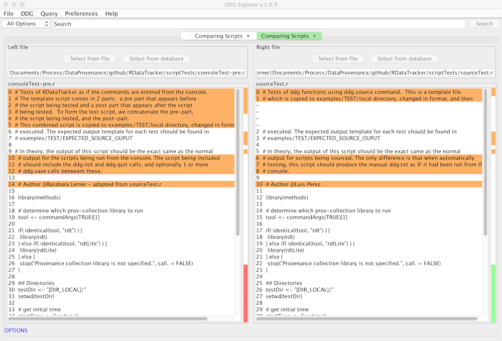

# DDG-Explorer

DDG Explorer is a tool that allows the user to view and query Data Derivation Graphs (DDGs). It has the following functionality:
* Ability to [visualize the provenance](#visualize), with the ability to expand and contract portions of the graph to selectively show or hide details.
* Ability to [view the data or R functions](#viewdata) referenced in the provenance
* Ability to [query the provenance](#query) to discover how an input data value gets used, or what data and processing steps lead to the derivation of a particular output value
* Ability to [search](#search) for where a particular data file is used or generated, or where an error was generated
* Ability to [find out what the slow parts of your script are](#execution-time)
* Ability to [compare R scripts](#compare) used to generate different provenance graphs
* Ability to [compare provenance](#compare-prov) generated by 2 different executions of a script

## Visualizing the provenance

The data provenance that we collect is stored in a graph. The nodes of the graph represent either data or processing steps. Red edges connect the data to the steps that use it as input or produce it as output. Blue edges connect processing steps directly to show control flow relationships.

While not shown in this visualization, the graph captures additional information related to the scientific computation. Data nodes capture the scientific data, including intermediate results produced during computation. Nodes that represent processing steps capture the R source code that the step represents.

The provenance graph snippet shown here was generated from running a simple R script demonstrating some basic steps in processing sensor data for general use. Focusing first on the yellow nodes, we see 2 steps:

1. Calibrate
2. Plot data

Each yellow node represents the execution of a function.

The purple nodes represent data values that are being manipulated by the script. A processing node with an arrow pointing to a data node indicates that the data were output from the processing step. For example, the calibrate step returns the result of doing the calibration.

Data input to functions shows how parameter bindings are done. For example, the calibrate function has a parameter named data. In the graph shown here, the argument passed in is raw.data. The beige node represents the binding from the argument to the parameter, taking as input the argument and producing as output the parameter, which is then input to the function.

The green nodes represent the start and finish of a chunk of related nodes. In this example, they correspond to a complete function execution, including the parameter binding and the binding of a return value to the place where it is called.

### Expanding and contracting abstraction layers

One of the key innovations of DDG-Explorer is the ability to capture abstraction and allow users to view their graphs at an abstract level or expand abstracted nodes to reveal more detail. By clicking on a blue node, the graph is expanded to show more detail. Clicking on a green (Start of Finish) node collapses that portion of the graph.

## Viewing data and R functions

The nodes in the graph retain connections to the scientific data, the R scripts and plots produced. By right-clicking on a data node in the graph, the user can see the values as they existed at that point in the computation.  The value might be a wide range of things, such as an integer, a data frame, a plot, or an R function. 

## Querying the provenance

There are two queries supported in DDG Explorer.  If you would like to know what operations led up to a particular data value, right-click on the data node and select "Show how value was computed".  The result will be a subgraph containing just the commands and data nodes that lead up to this value.

If you would like to know how a value is used in later computation, right-click on a data node and select "Show what is computed using this value".  This will show you a subgraph starting at this node and showing anything derived either directly or indirectly from this value.

## Searching the provenance

Another useful feature is to search the provenance.  You can search by typing in a node label, or part of a label.  Using the Options menu to the left of the search bar, you can limit the search based on the type of node (Error, File, URL, Data, Function).  Combining the search and query features can be powerful.  For example, if you select Error from the Options menu and leave the search field empty, you will get a list of all the error nodes.  Clicking on an entry in the list will scroll to its location in the DDG.  Then, you can right-click on the node, select "Show how the value was computed" and you will see a subgraph showing the operations that led to the error.

## Finding the slow parts of your script

Are you curious why your script runs slowly?  Use the "Display execution time of operations" command in the Query menu.  It will list all the operations sorted from slowest to fastest.

## Comparing R scripts

If you modify your script and get a new and unexpected result, you may want to see how you have changed your script to understand these differences.  Use the Compare R scripts in the File menu to do this.

## Comparing provenance

If you execute the same script multiple times, it will usually behave the same way.  It might behave differently if you use random numbers,
or if the input data files have changed.  If you modify the script, it will probably behave differently.  You can directly compare two
provenance graphs using the Compare DDGs command in the File menu.

## Build Instructions on Ubuntu (> 16.04)

1. Install 'ant' : `sudo apt-get install ant`
2. Install 'javac' : `sudo apt-get install default-jdk`
3. Clone the project: `git clone https://github.com/End-to-end-provenance/DDG-Explorer.git`
4. Build the src files present in the /src/ directory : `ant build-project`
5. Create the executable jar file : `ant ddg-explorer`
6. The working directory should now contain the jar : `ddg-explorer_{version}.jar`
